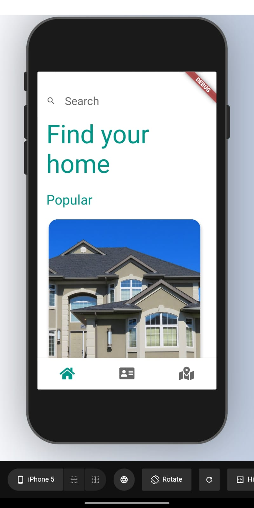
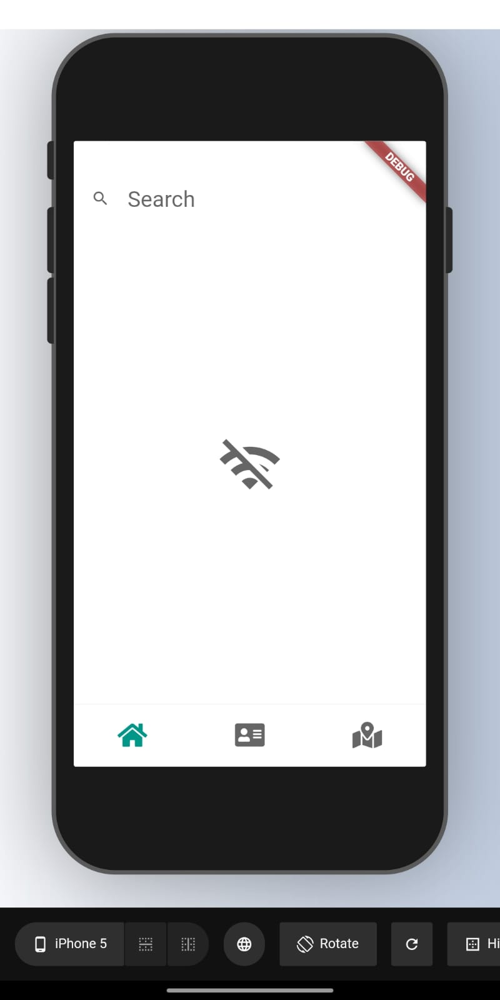

# Allen Real Estate

Real Estate Client App written in Dart/Flutter.

## Requirements
- App works on both android and IOS devices ✅
- Modify the profile screen with your own information ✅
- Fix the mapbox map in the profile screen ✅
- Modify Home and Real Estate Single Screens to display "No internet connection" when the user is not connected to the internet, make sure to try to reload the screen when connectivity is back ✅

             
        

